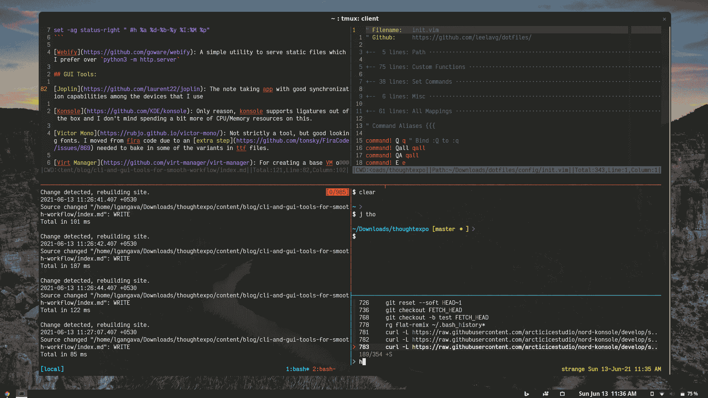
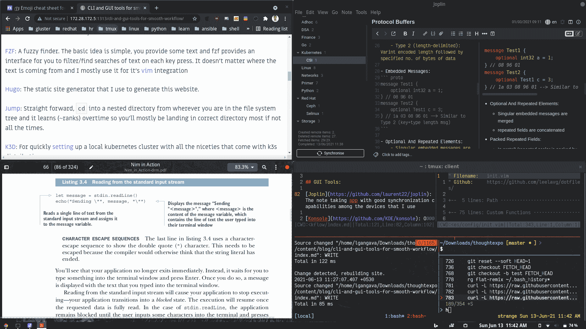

+++
title = "CLI and GUI tools for smooth workflow"
date = 2021-06-13T08:19:54+05:30
aliases = ["/cli-and-gui-tools-for-smooth-workflow"]
path = "cli-gui-tools"
[taxonomies]
tags = ["fedora", "productivity"]
+++

Between choosing fedora + gnome + required tools and fedora + tiling window manager + *only* required tools, I chose the former as I felt it fits my workflow good enough not to be obstructed.

On that note, I want to present tools that I use which are as per my needs and I feel you may also find some good ones to add to your tool chain even if you skim through this post.

Entire post is divided into two sections CLI and GUI which contain programs that you invoke when needed or silently running in the background. As the list is on a higher side and some may require an entire blog post I'll mention one or two use-cases only. {{emoji(i=":sweat_smile:")}}

Just choosing the alphabetical order, so your discretion is needed when one tool references other which may be at the end {{emoji(i=":smile:")}}

Unlike other posts of mine, I'm keeping this blog post short and simple and you can follow respective links for knowing more.

## CLI Tools:

[Ansible](https://github.com/ansible/ansible): When there are more than ~6 servers and need to run a remote command, I'll be using ansible. Less than 6, tmux is the way to go {{emoji(i=":wink:")}}

[Bash](https://www.gnu.org/software/bash/): I use bash shell with very little customization and below snippet (I don't remember the source {{emoji(i=":disappointed:")}}) is worth having in your bashrc if you want to preserve you command line history

``` sh
KEEP=200
for FILE in ~/.bash_history ~/.python_history
do
    BACKUP=$FILE.$(date +%y%m)
    if [ -s "$FILE" -a "$FILE" -nt "$BACKUP" ]; then
        # history file is newer than backup
        if [[ -f $BACKUP ]]; then
            # there is already a backup
            /usr/bin/cp -f $FILE $BACKUP
        else
            # create new backup, leave last few commands and reinitialize
            mv -f $FILE $BACKUP
            tail -n$KEEP $BACKUP > $FILE
            history -r
        fi
    fi
done
```

[Bat](https://github.com/sharkdp/bat): Bat uses powerful [syntect](https://github.com/trishume/syntect) library for syntax highlighting of text. `bat --plain` is a full replacement for `cat` command and you can inform `bat` to use a language syntax by passing `-l <lang>` option if a file doesn't have an extenstion.

[Dotfiles](https://github.com/leelavg/dotfiles): This isn't strictly a tool which you install, just stating here hoping it might help others on how I structure my dotfiles.

[FZF](https://github.com/junegunn/fzf): A fuzzy finder. The basic idea is simple, you provide some text and fzf provides an interface for you to filter/find searches of text on each key press. It doesn't matter where the text is coming from and I mostly use it for it's [vim](https://github.com/junegunn/fzf.vim) integration

[Hugo](https://github.com/gohugoio/hugo): The static site generator that I use to generate this website.

[Jump](https://github.com/gsamokovarov/jump): Straight forward, `cd` into a nested directory from wherever you are in the file system tree and it learns (~ranks) overtime so you'll mostly be landing in correct directory most if not all the times.

[K3D](https://github.com/rancher/k3d): For quickly [setting](../k3d-intro/) up a local kubernetes cluster with all the niceties that come with k3s distribution.

~~[Kyrat](https://github.com/fsquillace/kyrat):~~ The original repo of [sshrc](https://github.com/IngoMeyer441/sshrc) disappeared from github and found kyrat as a good alternative. In addition to some dotfiles I transport my `/etc/hosts` as well into remote host to change the prompt dynamically.

At times I had to manage close to ~20 servers and this tool is very helpful to figure out on which server I'm working on by looking at the prompt. I maintain a [fork](https://github.com/leelavg/kyrat/tree/fork) of this for my additional requirements.

**Update:** Not using anymore, there's no need for me to manage servers now.

~~[Neovim](https://github.com/neovim/neovim/):~~ Yes, I'm reaping the benefits of my initial investment of putting my own `init.vim`.

One nicety among hundreds is file system bookmarks, irrespective of wherever you are in the file system tree or tmux session, you can summon bookmarked file in `nvim`. For example, mark `init.vim` with `mV` and in any `nvim` window you can open `init.vim` using `'V` mark.

**Update:** Moved to [Helix](https://helix-editor.com/) editor

[Python](https://github.com/python/cpython): When bash data structures become cumbersome that's the time for python's list comprehensions (for quickly creating bricks string in gluster volume create commands)

[Ripgrep](https://github.com/BurntSushi/ripgrep): Better defaults than grep and I mostly use it as a companion for neovim and fzf vim integration.

[TLP](https://github.com/linrunner/TLP): I wasn't able to setup official [tuned](https://github.com/redhat-performance/tuned) program correctly and so has to use tlp which is surprisingly good with only exception being to be cautious when performing major upgrades.

I'm a fan of clean desk and don't want cables running around, tlp is able to get me through the day (if there are less meetings) without plugging power adapter.

[TMUX](https://github.com/tmux/tmux): Elephant in the room in terms of usage, the terminal multiplexer. I prefer restoring tmux sessions via [continuum](https://github.com/tmux-plugins/tmux-continuum) rather than [modeling sessions](https://github.com/ivaaaan/smug) from get go.

I follow one project per session and below snippet might be a good addition to your tmux.conf which adds `IN_SYNC` text to your status bar when panes are synchronized.
``` sh
set -g status-right "#{?pane_synchronized, #[fg=red]IN_SYNC#[default],}"
set -ag status-right " #h %a %d-%b-%y %I:%M %p"
```


[Vnstat](https://github.com/vergoh/vnstat): Well, this simple utility takes note of your network usage and displays in a nice tabular format for easy review. This is a pretty nice utility and I can't resist from sharing output from this and we can listen on any particular interface to check on live traffic as well.

``` sh
-> vnstat -d 2

 wlp0s20f3  /  daily

          day        rx      |     tx      |    total    |   avg. rate
     ------------------------+-------------+-------------+---------------
     2021-06-12     2.13 GiB |   43.65 MiB |    2.17 GiB |  215.52 kbit/s
     2021-06-13   166.89 MiB |   13.60 MiB |  180.49 MiB |   34.57 kbit/s
     ------------------------+-------------+-------------+---------------
     estimated    329.20 MiB |   26.83 MiB |  356.03 MiB |
```
I use hotspot from a mobile powered by [Sailfish OS](https://sailfishos.org/) which gives me maximum control over it and below is the data usage from that
``` sh
-> $ ssh nemo@172.28.172.1
nemo@172.28.172.1's password: 
Last login: Sun Jun 13 08:56:11 2021 from 172.28.172.5
,---
| Sailfish OS 4.0.1.48 (Koli)
'---
[nemo@Sailfish ~]$ vnstat -y

 wlan0  /  yearly

         year        rx      |     tx      |    total    |   avg. rate
     ------------------------+-------------+-------------+---------------
          2021    191.26 GiB |  393.47 GiB |  584.73 GiB |  355.54 kbit/s
     ------------------------+-------------+-------------+---------------
     estimated    426.95 GiB |  878.35 GiB |    1.27 TiB |
```

[Webify](https://github.com/goware/webify): A simple utility to serve static files which I prefer over `python3 -m http.server`

## GUI Tools:

[Joplin](https://github.com/laurent22/joplin): The note taking app with good synchronization capabilities among the devices that I use

~~[Konsole](https://github.com/KDE/konsole):~~ Only reason, konsole supports ligatures out of the box and I don't mind spending a bit more of CPU/Memory resources on this.

**Update:** Moved to a lightweight, fully functional alternative terminal, i.e, [foot](https://codeberg.org/dnkl/foot)

~~[Victor Mono](https://rubjo.github.io/victor-mono/):~~ Not strictly a tool, but good looking fonts. I moved from fira code due to an [extra step](https://github.com/tonsky/FiraCode/issues/869) needed to bake in some of the variants in ttf files.

**Update:** Moved to [JetBrains Mono](https://www.jetbrains.com/lp/mono/), then to [Inel One Mono](https://github.com/intel/intel-one-mono)

[Virt Manager](https://github.com/virt-manager/virt-manager): For creating a base VM on a KVM hypervisor or if I miss enabling `serial-getty@ttyS0` on a VM.

### GNOME Tweaks:

In addition to [tweaking](https://fedoramagazine.org/tweaking-the-look-of-fedora-workstation-with-themes/) look and feel of a fedora workstation there are a set of extensions which enhance user experience. I find [this](https://mutschler.eu/linux/install-guides/fedora-post-install/) article to be helpful as it targets firmare upgrade as well and also makes a note about [tweaks](https://mutschler.eu/linux/install-guides/fedora-post-install/#gnome-extensions-and-tweaks).

You can install below packages and later visit [extensions](https://extensions.gnome.org/) page to install shell extensions.
``` sh
-> sudo dnf install -y gnome-extensions-app gnome-tweaks
-> sudo dnf install -y gnome-shell-extension-appindicator
```

Below are some of the notable tweaks among many others that I use. Most of the times, when you upgrade an extension the status of that extension in [UI](https://extensions.gnome.org/local/) may change to `ERROR` state and in those cases logging out and logging in helps.

[Bing Wallpaper](https://extensions.gnome.org/extension/1262/bing-wallpaper-changer/): Change background image daily

[Clipboard Indicator](https://extensions.gnome.org/extension/779/clipboard-indicator/): Saves last n entries of yank into clipboard and can select particular entry for current paste

[Dash to Panel](https://extensions.gnome.org/extension/1160/dash-to-panel/): Change and position panel layout, comes with many customizations and don't get lost in it {{emoji(i=":smiley:")}}

[EasyScreenCast](https://extensions.gnome.org/extension/690/easyscreencast/): Probably the only extension that support Wayland compositor. The name says it all, you can record screen casts.

[GSConnect](https://extensions.gnome.org/extension/1319/gsconnect/): Think of AirPlay with just enough functionality that makes sharing/controlling devices simpler.

In the companion kdeconnect mobile app, you can set below run commands to lock and unlock your fedora remotely when you are on same network.

``` sh
-> Lock: loginctl lock-session
-> Unlock: loginctl unlock-session
```

~~[WinTile](https://extensions.gnome.org/extension/1723/wintile-windows-10-window-tiling-for-gnome/):~~ I can get away without using dual monitors with this extension and at most I open not more than 4 windows and able to manage my screen estate just good enough.


**Update:** Moved to wonderful [Tactile](https://extensions.gnome.org/extension/4548/tactile/).

## Misc:

I wasn't able to segregate some in above buckets due to their less frequency of use by me or widely known to others and here they are:

- [Swapping](https://opensource.com/article/18/11/how-swap-ctrl-and-caps-lock-your-keyboard) `Ctrl` and `CapsLock` functionality
- ~~[Octotree](https://chrome.google.com/webstore/detail/octotree-github-code-tree/bkhaagjahfmjljalopjnoealnfndnagc), Github code tree navigation~~
- Virtualization tools: [libvirt](https://github.com/libvirt/libvirt) and it's entire suite of tools notably `virsh`, `virt-df`, `virt-sysprep`, `virt-builder`, `virt-clone` among others
- [Git](https://github.com/git/git), [ExplainShell](https://explainshell.com/), [PipTools](https://github.com/jazzband/pip-tools), [Dive](https://github.com/wagoodman/dive)

Well, we reached the end and I'll update the post if there are any tools worth mentioning here and explain some of the tools in depth if I get any requests {{emoji(i=":smile:")}}
